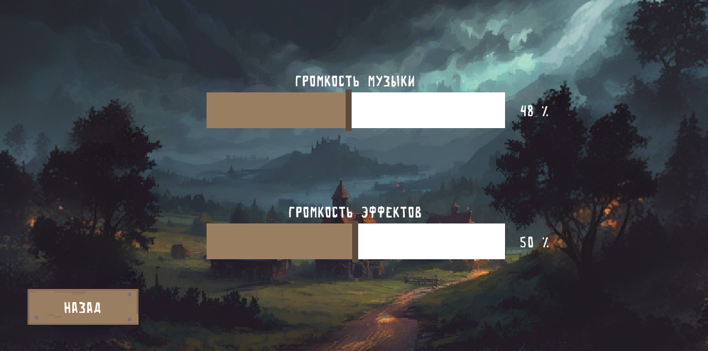
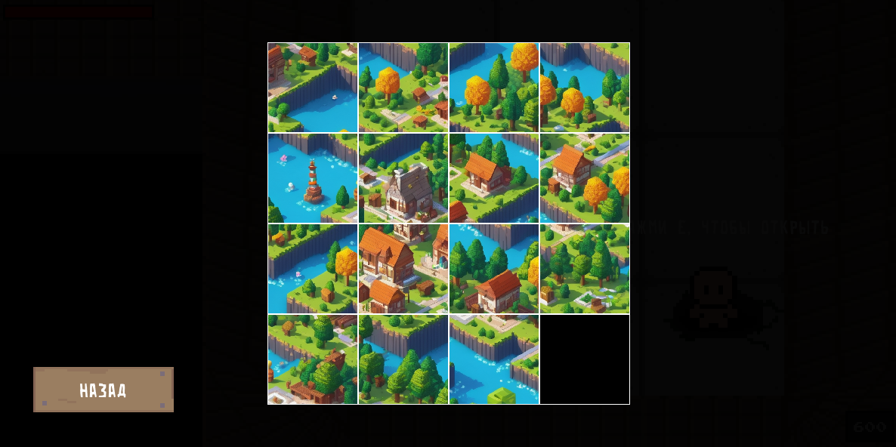

# The Dude

  <h1>  
Смысл игры
  <h1>
    
<h3>
  Смысл игры:
</h3>
    
_Жанр игры: Action-Adventure. Стиль игры: pixel art. Основной геймплей игры заключается в зачистке уровней от противников и решении головоломок для продвижения по сюжету._
    
---

  <h2>
     Главное меню
  </h2>

 _🎵 В игре есть музыка, которая меняется в зависимости от места, в меню также есть музыка 🎵_

  <h2>
     Меню настроек
  </h2>

 _💬 При выходе из игры настройки сохраняются 💬_

  <h2>
     Геймплей
  </h2>

https://github.com/oxreng/arcade_project/assets/105565251/8a9e5bdf-28b5-42f9-8c38-43fd26a78e6a

https://github.com/oxreng/arcade_project/assets/105565251/55e4dbe6-ecfb-49cf-8c71-6f80e07979d3

  <h2>
     Мини-игры
  </h2>

 _🎲 Иногда, при прохождении игры, нужно будет разгыдвать головоломки 🎲_
